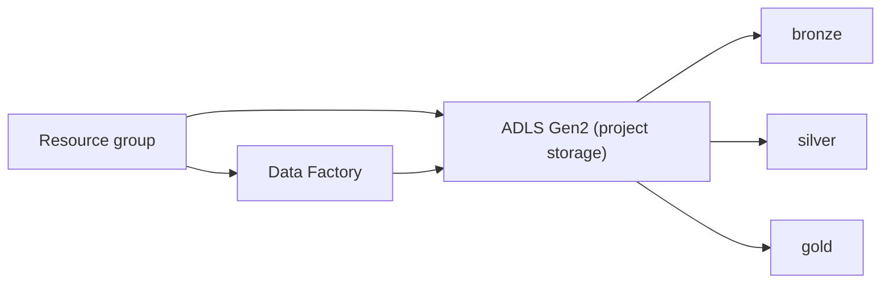
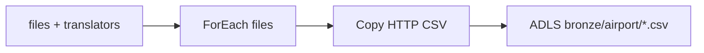
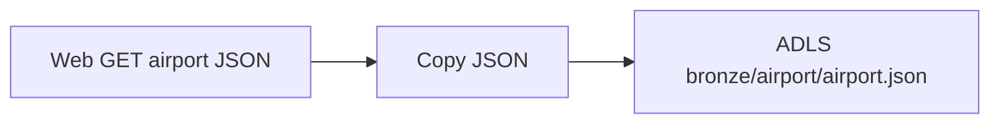
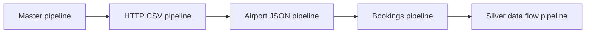
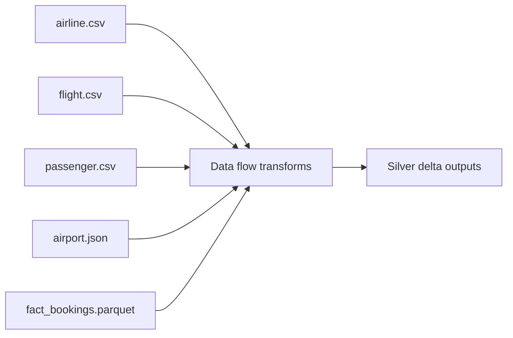
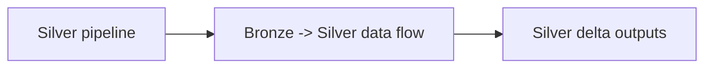
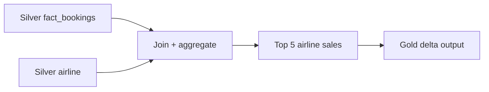

# Azure Airline Data Engineering (IaC)

Terraform-first infrastructure for an airline data engineering project on Azure.

## Introduction
This project builds a small airline data platform on Azure using Terraform. The bronze layer ingests reference CSVs and airport JSON from HTTP plus incremental fact bookings from Azure SQL, all orchestrated by Data Factory.

## Real-World Use Case
Airlines and travel ops teams need to combine static reference data (airlines, flights, passengers) with transactional bookings to power dashboards, audits, and incremental refresh pipelines. This project shows how to land raw data reliably in a bronze layer with monitoring markers for repeatable loads.

## Quick Start
1) Install prerequisites:
   - Azure CLI (az)
   - Terraform (>= 1.5)
   - Python 3.10+

2) Authenticate to Azure:
```powershell
az login
az account show
```

3) Deploy infrastructure:
```powershell
python scripts\deploy.py
```
This deploys the resource group, storage account, data factory, ADF linked services, and the ADF pipeline.

For SQL deployments, Entra admin login defaults to the signed-in Azure CLI user if `AZUREAD_ADMIN_LOGIN` is not set. Password and client IP are auto-generated/detected if omitted and written to `terraform/07_sql_database/terraform.tfvars` (gitignored):
```powershell
$env:AZUREAD_ADMIN_LOGIN = "your.name@domain.com"
$env:SQL_ADMIN_LOGIN = "sqladmin"
```


## Architecture Overview


## Bronze Pipelines
### HTTP CSV Pipeline


### Airport JSON Pipeline


### FactBookings Incremental Pipeline
```mermaid
flowchart LR
    lastload[Lookup last_load.json] --> copy[Copy SQL -> Parquet]
    latest[Lookup MAX(booking_date)] --> copy
    copy --> sink[ADLS bronze/airport/fact_bookings.parquet]
    copy --> update[Update last_load.json]
    empty[empty.json] --> update
    update --> marker[ADLS bronze/monitor/lastload/last_load.json]
```

### Master Pipeline


### Bronze -> Silver Data Flow


### Silver Data Flow Pipeline


### Gold Data Flow


## Resource Naming
Resources use a prefix plus a random pet suffix for uniqueness, for example:
`rg-airline-cool-otter`
`stairlinecoolotter`
`adf-airline-cool-otter`
Set `resource_group_name` in `terraform/01_resource_group/terraform.tfvars` (or edit defaults in `scripts/deploy.py`) to override.

## Project Structure
- `terraform/01_resource_group`: Azure resource group
- `terraform/02_storage_account`: ADLS Gen2 storage account + medallion containers
- `terraform/03_data_factory`: Azure Data Factory v2
- `terraform/04_adf_linked_services`: ADF linked services (HTTP via azapi + SQL + ADLS Gen2)
- `terraform/05_adf_pipeline_http`: ADF pipeline + datasets (foreach -> copy with translator parameters)
- `terraform/06_adf_pipeline_airport_json`: ADF pipeline + datasets (web -> copy for JSON airport data)
- `terraform/07_sql_database`: Azure SQL Server + database
- `terraform/08_adf_pipeline_fact_bookings_incremental`: ADF pipeline + datasets (SQL incremental load -> parquet)
- `terraform/09_adf_pipeline_master`: ADF pipeline orchestrator (executes all pipelines)
- `terraform/10_adf_dataflow_bronze_silver`: ADF mapping data flow (bronze -> silver transformations)
- `terraform/11_adf_pipeline_silver_dataflow`: ADF pipeline to execute the bronze-to-silver data flow
- `terraform/12_adf_dataflow_gold_sales`: ADF mapping data flow (silver -> gold airline sales)
- `scripts/`: Deploy/destroy helpers (auto-writes terraform.tfvars)
- `guides/setup.md`: Detailed setup guide
- `data/`: Local data assets
- `parameters/`: Reference JSON for pipeline parameter defaults

Example variables files:
- `terraform/01_resource_group/terraform.tfvars.example`
- `terraform/02_storage_account/terraform.tfvars.example`
- `terraform/03_data_factory/terraform.tfvars.example`
- `terraform/04_adf_linked_services/terraform.tfvars.example`
- `terraform/05_adf_pipeline_http/terraform.tfvars.example`
- `terraform/06_adf_pipeline_airport_json/terraform.tfvars.example`
- `terraform/07_sql_database/terraform.tfvars.example`
- `terraform/08_adf_pipeline_fact_bookings_incremental/terraform.tfvars.example`
- `terraform/09_adf_pipeline_master/terraform.tfvars.example`
- `terraform/10_adf_dataflow_bronze_silver/terraform.tfvars.example`
- `terraform/11_adf_pipeline_silver_dataflow/terraform.tfvars.example`
- `terraform/12_adf_dataflow_gold_sales/terraform.tfvars.example`

## ADF Pipeline Mapping
The pipeline uses translator objects as pipeline parameters (`p_translator_airline`, `p_translator_flight`, `p_translator_passenger`).
The Copy activity chooses the translator per file inside the ForEach, so the mapping is dynamic.
ADF Studio may not render these mappings in the grid; check the Copy activity JSON if you need to verify.

## ADF Airport JSON Pipeline
The airport pipeline runs a Web activity (GET) followed by a Copy activity that writes JSON to ADLS.
The source and sink datasets use JSON schema imported from `data/DimAirport.json`.

## ADF FactBookings Incremental Pipeline
The bookings pipeline reads the last load marker from `bronze/monitor/lastload/last_load.json`,
queries `dbo.FactBookings` for new rows, writes Parquet into `bronze/airport`, and updates the marker.

## ADF Master Pipeline
The master pipeline executes the HTTP CSV, airport JSON, and bookings pipelines in sequence and passes
their parameters through (`@pipeline().parameters.*`), then executes the silver data flow pipeline.

## ADF Bronze-to-Silver Data Flow
The data flow reads five bronze datasets, applies clean-up and enrichment transforms (trim, casing, derived time fields, and booking date attributes),
and writes delta outputs to `silver/airport` with upsert semantics.

## ADF Silver Data Flow Pipeline
The silver pipeline executes the bronze-to-silver data flow and is invoked by the master pipeline after the bookings load.

## ADF Gold Data Flow
The gold data flow joins silver bookings with airlines, aggregates total sales, ranks airlines by revenue, and lands the top 5 into the gold layer.

## Azure SQL
The SQL module provisions an Azure SQL Server + database. After deployment, you can initialize the schema by running `sql_scripts/fact_bookings_full.sql` via `sqlcmd` or the Azure Portal Query Editor. Run `python scripts\deploy.py --sql-only --sql-init` to execute it via `sqlcmd`.

## Deploy/Destroy Options
Deploy:
```powershell
python scripts\deploy.py
python scripts\deploy.py --rg-only
python scripts\deploy.py --storage-only
python scripts\deploy.py --sql-only
python scripts\deploy.py --datafactory-only
python scripts\deploy.py --adf-links-only
python scripts\deploy.py --adf-pipeline-only
python scripts\deploy.py --adf-airport-pipeline-only
python scripts\deploy.py --adf-bookings-pipeline-only
python scripts\deploy.py --adf-master-pipeline-only
python scripts\deploy.py --adf-dataflow-only
python scripts\deploy.py --adf-silver-pipeline-only
python scripts\deploy.py --adf-gold-dataflow-only
python scripts\deploy.py --sql-only --sql-init
python scripts\deploy.py --skip-sql-init
```

Destroy:
```powershell
python scripts\destroy.py
python scripts\destroy.py --rg-only
python scripts\destroy.py --storage-only
python scripts\destroy.py --sql-only
python scripts\destroy.py --datafactory-only
python scripts\destroy.py --adf-links-only
python scripts\destroy.py --adf-pipeline-only
python scripts\destroy.py --adf-airport-pipeline-only
python scripts\destroy.py --adf-bookings-pipeline-only
python scripts\destroy.py --adf-master-pipeline-only
python scripts\destroy.py --adf-dataflow-only
python scripts\destroy.py --adf-silver-pipeline-only
python scripts\destroy.py --adf-gold-dataflow-only
```

## Guide
See `guides/setup.md` for detailed instructions.
