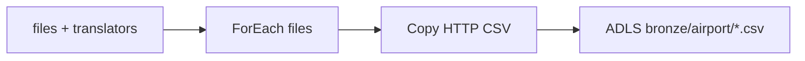
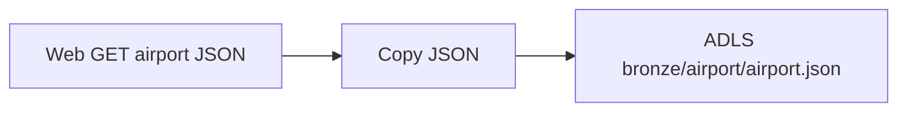
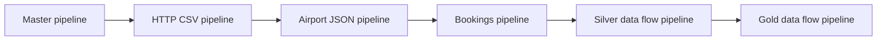
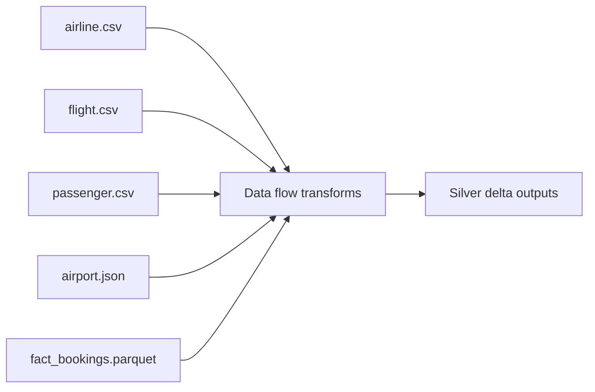
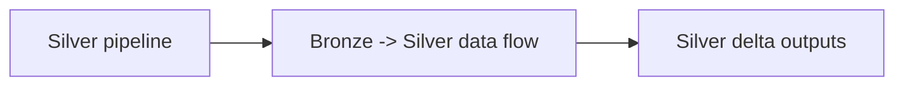
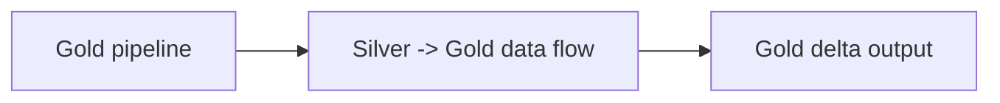
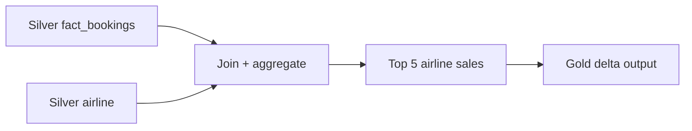

# Project Setup Guide

This project provisions Azure resources using Terraform and includes helper scripts.

## Prerequisites
- Azure CLI (az) installed and authenticated
- Terraform installed (>= 1.5)
- Python 3.10+ (for running the helper scripts)

## Azure CLI
Check your Azure CLI and login status:

```powershell
az --version
az login
az account show
```

If you need to switch subscriptions:

```powershell
az account list --output table
az account set --subscription "<subscription-id-or-name>"
az account show
```

## Terraform Setup
Check if Terraform is installed and on PATH:

```powershell
terraform version
```

Install or update Terraform on Windows:

```powershell
winget install HashiCorp.Terraform
```

```powershell
choco install terraform -y
```

After installing, re-open PowerShell and re-run terraform version.

## Project Structure
- `terraform/01_resource_group`: Azure resource group
- `terraform/02_storage_account`: ADLS Gen2 storage account + medallion containers
- `terraform/03_data_factory`: Azure Data Factory v2
- `terraform/04_adf_linked_services`: ADF linked services (HTTP via azapi + SQL + ADLS Gen2)
- `terraform/05_adf_pipeline_http`: ADF pipeline + datasets (foreach -> copy with translator parameters)
- `terraform/06_adf_pipeline_airport_json`: ADF pipeline + datasets (web -> copy for JSON airport data)
- `terraform/07_sql_database`: Azure SQL Server + database
- `terraform/08_adf_pipeline_fact_bookings_incremental`: ADF pipeline + datasets (SQL incremental load -> parquet)
- `terraform/09_adf_pipeline_master`: ADF pipeline orchestrator (executes all pipelines)
- `terraform/10_adf_dataflow_bronze_silver`: ADF mapping data flow (bronze -> silver transformations)
- `terraform/11_adf_pipeline_silver_dataflow`: ADF pipeline to execute the bronze-to-silver data flow
- `terraform/12_adf_dataflow_gold_sales`: ADF mapping data flow (silver -> gold airline sales)
- `terraform/13_adf_pipeline_gold_dataflow`: ADF pipeline to execute the gold data flow
- `scripts/`: Helper scripts to deploy/destroy Terraform resources
- `guides/setup.md`: This guide
- `data/`: Local data assets
- `parameters/`: Reference JSON for pipeline parameter defaults

## Bronze Pipelines
### HTTP CSV Pipeline


### Airport JSON Pipeline


### FactBookings Incremental Pipeline
```mermaid
flowchart LR
    lastload[Lookup last_load.json] --> gate{Latest > Last?}
    latest[Lookup MAX(booking_date)] --> gate
    gate --> copy[Copy SQL -> Parquet]
    copy --> sink[ADLS bronze/airport/fact_bookings.parquet]
    copy --> update[Update last_load.json]
    empty[empty.json] --> update
    update --> marker[ADLS bronze/monitor/lastload/last_load.json]
```

### Master Pipeline


### Bronze -> Silver Data Flow


### Silver Data Flow Pipeline


### Gold Data Flow Pipeline


### Gold Data Flow


## Configure Terraform
The deploy script writes `terraform/01_resource_group/terraform.tfvars`,
`terraform/02_storage_account/terraform.tfvars`, and
`terraform/03_data_factory/terraform.tfvars` automatically.
If you want different defaults, edit `DEFAULTS` in `scripts/deploy.py` before running.

Example variables files:
- `terraform/01_resource_group/terraform.tfvars.example`
- `terraform/02_storage_account/terraform.tfvars.example`
- `terraform/03_data_factory/terraform.tfvars.example`
- `terraform/04_adf_linked_services/terraform.tfvars.example`
- `terraform/05_adf_pipeline_http/terraform.tfvars.example`
- `terraform/06_adf_pipeline_airport_json/terraform.tfvars.example`
- `terraform/07_sql_database/terraform.tfvars.example`
- `terraform/08_adf_pipeline_fact_bookings_incremental/terraform.tfvars.example`
- `terraform/09_adf_pipeline_master/terraform.tfvars.example`
- `terraform/10_adf_dataflow_bronze_silver/terraform.tfvars.example`
- `terraform/11_adf_pipeline_silver_dataflow/terraform.tfvars.example`
- `terraform/12_adf_dataflow_gold_sales/terraform.tfvars.example`
- `terraform/13_adf_pipeline_gold_dataflow/terraform.tfvars.example`

## Resource Naming
Resource names are built from a prefix plus a random pet suffix.
Override them by setting explicit name variables or changing the prefixes.

## Deploy Resources
From the repo root or scripts folder, run:

```powershell
python scripts\deploy.py
```

The deploy script applies the pipeline in two steps (target the pipeline resource, then full apply) to avoid ADF update ordering issues.

Optional flags:

```powershell
python scripts\deploy.py --rg-only
python scripts\deploy.py --storage-only
python scripts\deploy.py --sql-only
python scripts\deploy.py --datafactory-only
python scripts\deploy.py --adf-links-only
python scripts\deploy.py --adf-pipeline-only
python scripts\deploy.py --adf-airport-pipeline-only
python scripts\deploy.py --adf-bookings-pipeline-only
python scripts\deploy.py --adf-master-pipeline-only
python scripts\deploy.py --adf-dataflow-only
python scripts\deploy.py --adf-silver-pipeline-only
python scripts\deploy.py --adf-gold-pipeline-only
python scripts\deploy.py --adf-gold-dataflow-only
python scripts\deploy.py --sql-only --sql-init
python scripts\deploy.py --skip-sql-init
```

## Destroy Resources
To tear down resources:

```powershell
python scripts\destroy.py
```

Optional flags:

```powershell
python scripts\destroy.py --rg-only
python scripts\destroy.py --storage-only
python scripts\destroy.py --sql-only
python scripts\destroy.py --datafactory-only
python scripts\destroy.py --adf-links-only
python scripts\destroy.py --adf-pipeline-only
python scripts\destroy.py --adf-airport-pipeline-only
python scripts\destroy.py --adf-bookings-pipeline-only
python scripts\destroy.py --adf-master-pipeline-only
python scripts\destroy.py --adf-dataflow-only
python scripts\destroy.py --adf-silver-pipeline-only
python scripts\destroy.py --adf-gold-pipeline-only
python scripts\destroy.py --adf-gold-dataflow-only
```

## Notes
- If you run Terraform directly in a module (not via the scripts), run `terraform init` first to create/update the provider lock file.
- Storage defaults to Standard performance, LRS, ADLS Gen2 (HNS enabled), and public network access.
- Containers created by default: bronze, silver, gold.
- The storage module uploads `sql_scripts/empty.json` to `bronze/monitor/emptyjson/empty.json` and seeds `bronze/monitor/lastload/last_load.json`.
- Linked services include an HTTP source (via azapi), Azure SQL Database, and ADLS Gen2 sink (account key).
- The ADF pipeline stores the file list plus translator objects as pipeline parameters (`p_translator_*`).
- The Copy activity selects the translator per file inside the ForEach, so mappings are dynamic.
- ADF Studio may show an empty Mapping grid; verify mappings in the Copy activity JSON instead.
- The pipeline copies each HTTP CSV into `bronze/airport/<file>` using the per-file translator.
- The airport JSON pipeline runs a Web activity (GET) and copies the JSON into `bronze/airport/airport.json`.
- The bookings pipeline reads `bronze/monitor/lastload/last_load.json`, loads new SQL rows into `bronze/airport`, and updates the marker only when new rows exist.
- The master pipeline executes the HTTP CSV, airport JSON, bookings, silver data flow, and gold data flow pipelines in sequence.
- The bronze-to-silver data flow standardizes and enriches all five datasets before landing them in `silver/airport` as delta outputs.
- The gold data flow rolls up airline sales and writes the top 5 airlines into `gold/airport`.
- The SQL module provisions an Azure SQL Server + database. Initialize it with `sql_scripts/fact_bookings_full.sql`.

## SQL Setup
The deploy script can run the SQL init script using `sqlcmd`. Set the environment variables below or let the script infer values:

```powershell
$env:AZUREAD_ADMIN_LOGIN = "your.name@domain.com"
$env:SQL_ADMIN_PASSWORD = "UseAStr0ng!Passw0rd"
$env:SQL_ADMIN_LOGIN = "sqladmin"
$env:SQL_CLIENT_IP = "<your-public-ip>"
```

To run the SQL init script automatically:
```powershell
python scripts\deploy.py --sql-only --sql-init
```

Install `sqlcmd` if needed:
```powershell
winget install Microsoft.Sqlcmd
```

```powershell
choco install sqlcmd -y
```

To run the SQL init script manually in the Azure Portal:
1) Open the SQL database in Azure Portal -> Query editor (preview).
2) Login using the SQL admin login/password from `terraform/07_sql_database/terraform.tfvars`.
3) Paste and run `sql_scripts/fact_bookings_full.sql`.

If you did not set `SQL_ADMIN_PASSWORD`, read it from `terraform/07_sql_database/terraform.tfvars`.

- Data Factory is provisioned as v2 with a random pet suffix by default.
- Terraform state and tfvars files are gitignored by default.
- The random suffix keeps resource names unique per deployment.
